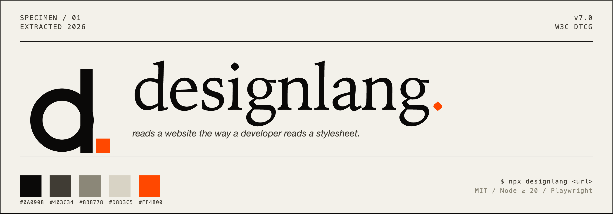
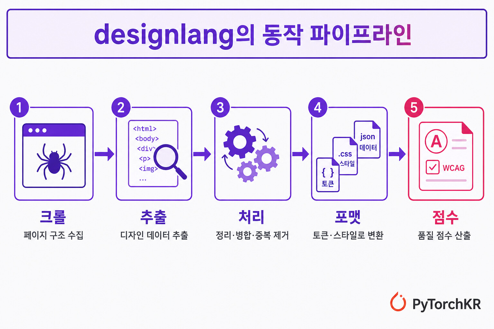

# designlang (Document 10494)

designlang은 웹사이트의 디자인 시스템을 한 번에 추출하는 CLI와 AI 에이전트 도구이다.

## 소개 및 기능

타겟 사이트의 디자인을 참고하여 프로젝트에 옮기는 작업을 자동화하는 명령 한 줄 도구이다. Playwright 기반 헤드리스 브라우저(chromium)를 임의의 URL에 띄워 살아있는 DOM에서 디자인 시스템을 직접 읽어내고, 한 번 실행으로 W3C DTCG 디자인 토큰(Design Tokens), [[contents/Tailwind_10494]] 설정, shadcn 테마, [[contents/Figma_10494]] 변수, 모션 토큰, 타입 지정 컴포넌트 구조, 브랜드 보이스 등을 포함한 17개 이상의 파일을 자동으로 생성한다.

단순한 토큰 추출을 넘어 디자인의 구조(그리드, 플렉스 컨테이너 등), 반응형 동작(4개 브레이크포인트), 상호작용 상태(hover, focus, active), 그리고 전경/배경 색상 쌍에 대한 [[contents/WCAG_10494]] 명암비 점수까지 제공하는 것이 특징이다.

## 동작 파이프라인

designlang의 디자인 추출 과정은 크게 다섯 단계로 구분된다.

1. **크롤**: Playwright 기반 Chromium으로 페이지를 크롤링하고 네트워크 및 폰트 로딩이 완료될 때까지 대기한다.
2. **추출**: 단 한 번의 `page.evaluate()` 호출을 통해 최대 5,000개의 DOM 요소를 순회하며 25개 이상의 계산된 속성, 인라인 SVG, 폰트 소스, 이미지 메타데이터를 수집한다.
3. **처리**: 수집된 원시 데이터를 17개의 추출 모듈이 파싱, 중복 제거, 클러스터링, 분류한다.
4. **포맷**: 12개 이상의 포매터 모듈을 거쳐 JSON, JS, CSS 등 결과 파일로 내보낸다.
5. **점수**: 접근성 추출기가 모든 색상 쌍의 [[contents/WCAG_10494]] 명암비를 계산하여 접근성 점수를 산출한다.

## AI 코딩 워크플로 연동

CLI 뿐만 아니라 VS Code 확장, Raycast 확장, Figma 플러그인, GitHub Action, Chrome 확장 등 다양한 환경에서 제공된다. 특히 AI 도구와의 연동으로 다음 두 가지 경로를 지원한다.
- **[[contents/MCP_10494]] 서버**: `designlang mcp` 명령을 실행해 추출한 토큰, 영역, 컴포넌트, 명암비 점수를 MCP 리소스와 도구로 노출하여 [[contents/Cursor_10494]], [[contents/Claude Code_10494]] 등 에이전트가 직접 참조할 수 있도록 한다.
- **[[contents/Claude Code_10494]] 플러그인**: 저장소의 `.claude-plugin/` 디렉토리를 통해 `/extract`, `/grade`, `/battle`, `/remix`, `/pack` 등 5가지 슬래시 명령어를 지원한다.
